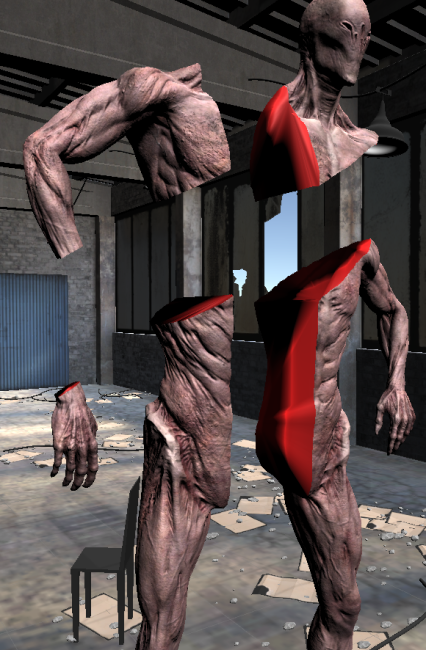
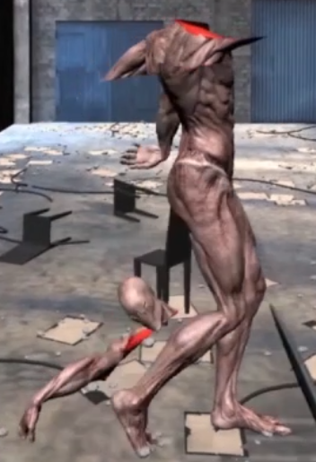
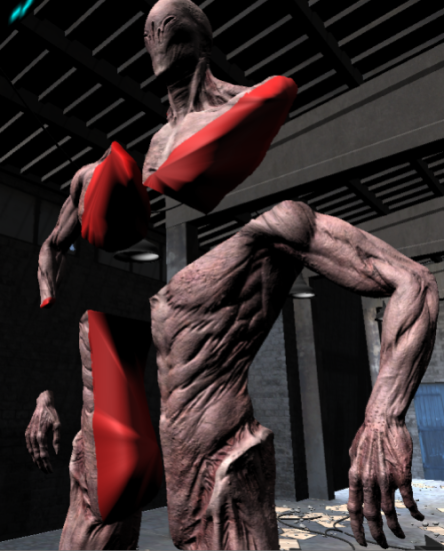
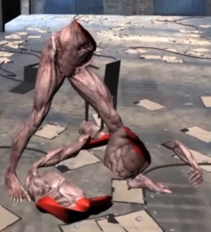

# UnitySkinnedMeshSlicer_3A
Concise basic functions about cuts skinned mesh in Unity3D; Accurately, Alternately, Asynchronously ; )
## Result
 
 
## Journey and Acknowledgments
### *First week: Try it myself!*
Roughly two weeks before I write those words, I try to do something fun but not completely useless, so I choose to write something that can cuts skinned mesh. I've heard few paid addon does something similar, but I don't mind, the purpose of this journey for me is to do it myself!

There basically few main problems: divide mesh by plane, create cap after divide, reassign bones weights to vertices, and calculate some other data for create new mesh. Those problems is not hard, just need find the way to pass some limit of unity engine and calculates, and I solved them days by days.

Of course, there always lot of experiments to be done before one can know which approach does best. For example, there's the day I try to make slice perfect, try things like to distinguish each different area after slice, then I find out for slice 6000+ vertices skinned mesh, it gonna cost 10s on my "not so suck" laptop, which is useless in real-time game... well, meet old friend of any researcher -> when end of day you only know something will not working.
### *Second week: Learn from others!*
And finally! after roughly one week of my afternoon from moment I started, those work of mine pay back with decent result. What I did next is compare it with other work that solve similar problems, after some search on internet, I find there really only two project work on this problems, [MeshSlicer](https://assetstore.unity.com/packages/tools/modeling/mesh-slicer-59618) and [LimbHacker](https://github.com/NobleMuffins/LimbHacker).

After try them both, I find that LimbHacker does really poor job on both slice and after slice, This tool is old and can't fill the cap correct. MeshSlicer on the other hand did fairly good job, so I decied look in it source code to see if I can learn anything to help me with my work.

Lot of the approch are very similar with my work, because there no better answer to those narrow questions, the things that surprised me is we use the same method to fill the cap, I have to say I expect better one, well, guess good enough is enough right?

But it did help, by the way it implement those methods, some of the code structure, data format, and especially few comments, hope the author of MeshSlicer don't mind if I modify bit code in to this public work. Special thanks to the author who create this addon, very good work, learn a lot from it.
### *Summary*
Compare runtime, my work is faster than MeshSlicer, my laptop have (Inter(R) Core(TM) i5-6300HQ CPU) which just normal Quad-core CPU, use MeshSlicer to slice a character with 7000 vertices and 12000 triangles even with asynchronous turn on still gonna stuck for about 0.5 second, my work on the other hand to slice a character with 20000 vertices and 37000 triangles with asynchronous turn on the slice finished instantly, even without asynchronous the whole process is finish in less than 0.1 second.

Yes, one reason my work here is faster campare to MeshSlicer because it doesn't have some extra function, for example, check if the mesh have the hole inside, or optimize some vertices data while slice and etc...but MeshSlicer is end product took many more time than my merely two weeks, and many more code than my merely one thousand line of code, my work just like what i said, a concise basic functions about cuts skinned mesh in Unity3D, I does what I says.

Those basic functions can easily extend to fit various needs, for example, one may want only cut the enemy's arm in front but not the head behind it, do some mesh optimization before or after cuts, or after slice one don't want use ragdoll but still the animation, and etc... one can easily modify it by whatever needs, hope this work can help your and my future works, cheers!

